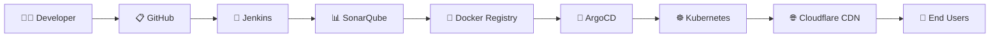
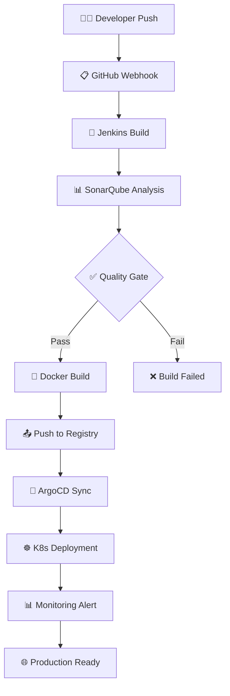

# 🚀 Kafrika MSA Infrastructure

<div align="center">
  
[](https://kubernetes.io/)
[](https://spring.io/projects/spring-boot)
[](https://www.postgresql.org/)
[](https://kafka.apache.org/)

</div>

<div align="center">
  
[](https://www.docker.com/)
[](https://argoproj.github.io/argo-cd/)
[](https://www.sonarqube.org/)
[](https://docs.docker.com/registry/)

</div>

<div align="center">
  
[](https://nginx.org/)
[](https://grafana.com/)
[](https://www.jenkins.io/)
[](https://www.cloudflare.com/)

</div>

---

## 📋 Project Overview

**Kafrika**는 Microservice Architecture(MSA) 기반의 실시간 채팅 애플리케이션입니다.
Kubernetes 환경에서 독립적인 서비스 배포와 관리를 제공하며, Kafka 메시지 큐와 PostgreSQL을 활용한 고성능 채팅 시스템을 구현합니다. Jenkins와 SonarQube를 통한 완전한 CI/CD 파이프라인과 Private Docker Registry를 구축하여 엔터프라이즈급 개발 환경을 제공합니다.

### ✨ Key Features

- 🎯 **마이크로서비스 아키텍처**: 독립적이고 확장 가능한 서비스 구조
- 📊 **실시간 모니터링**: Prometheus, Grafana, Loki 통합 모니터링
- 🔄 **완전한 CI/CD**: Jenkins + SonarQube + ArgoCD 기반 자동화된 배포 파이프라인
- 🐳 **Private Docker Registry**: 보안이 강화된 컨테이너 이미지 관리
- 📈 **코드 품질 관리**: SonarQube를 통한 정적 코드 분석
- 🛡️ **고가용성**: Kubernetes 클러스터 기반 안정적인 운영
- 🌐 **CDN 최적화**: Cloudflare를 통한 글로벌 콘텐츠 배포

---

## 🏗️ System Architecture

<div align="center">
  
</div>

### 🔄 Complete CI/CD Pipeline Flow



---

## 🌐 Deployed Services

<table>
  <thead>
    <tr>
      <th>🎯 Service</th>
      <th>🔌 Port</th>
      <th>📊 Replicas</th>
      <th>💚 Status</th>
      <th>📝 Description</th>
    </tr>
  </thead>
  <tbody>
    <tr>
      <td><strong>API Gateway</strong></td>
      <td><code>30512</code></td>
      <td>1</td>
      <td>✅ Running</td>
      <td>Nginx 기반 라우팅</td>
    </tr>
    <tr>
      <td><strong>Auth Service</strong></td>
      <td><code>8082</code></td>
      <td>2</td>
      <td>✅ Running</td>
      <td>사용자 인증/인가</td>
    </tr>
    <tr>
      <td><strong>Chat Service</strong></td>
      <td><code>8081</code></td>
      <td>2</td>
      <td>✅ Running</td>
      <td>채팅 메시지 처리</td>
    </tr>
    <tr>
      <td><strong>Kafrika Backend</strong></td>
      <td><code>8080</code></td>
      <td>2</td>
      <td>✅ Running</td>
      <td>기존 모놀리식 서비스</td>
    </tr>
    <tr>
      <td><strong>PostgreSQL</strong></td>
      <td><code>5432</code></td>
      <td>1</td>
      <td>✅ Running</td>
      <td>메인 데이터베이스</td>
    </tr>
    <tr>
      <td><strong>Apache Kafka</strong></td>
      <td><code>9092</code></td>
      <td>1</td>
      <td>✅ Running</td>
      <td>메시지 큐</td>
    </tr>
    <tr>
      <td><strong>Zookeeper</strong></td>
      <td><code>2181</code></td>
      <td>1</td>
      <td>✅ Running</td>
      <td>Kafka 관리</td>
    </tr>
  </tbody>
</table>

### 🔧 DevOps & Monitoring Services

<table>
  <thead>
    <tr>
      <th>🛠️ Service</th>
      <th>🔌 Port</th>
      <th>📊 Replicas</th>
      <th>💚 Status</th>
      <th>📝 Description</th>
    </tr>
  </thead>
  <tbody>
    <tr>
      <td><strong>Jenkins</strong></td>
      <td><code>8080</code></td>
      <td>1</td>
      <td>✅ Running</td>
      <td>CI/CD 파이프라인</td>
    </tr>
    <tr>
      <td><strong>SonarQube</strong></td>
      <td><code>9000</code></td>
      <td>1</td>
      <td>✅ Running</td>
      <td>코드 품질 분석</td>
    </tr>
    <tr>
      <td><strong>Docker Registry</strong></td>
      <td><code>5000</code></td>
      <td>1</td>
      <td>✅ Running</td>
      <td>Private 이미지 저장소</td>
    </tr>
    <tr>
      <td><strong>ArgoCD</strong></td>
      <td><code>30080</code></td>
      <td>1</td>
      <td>✅ Running</td>
      <td>GitOps 배포</td>
    </tr>
    <tr>
      <td><strong>Prometheus</strong></td>
      <td><code>30090</code></td>
      <td>1</td>
      <td>✅ Running</td>
      <td>메트릭 수집</td>
    </tr>
    <tr>
      <td><strong>Grafana</strong></td>
      <td><code>3000</code></td>
      <td>1</td>
      <td>✅ Running</td>
      <td>모니터링 대시보드</td>
    </tr>
    <tr>
      <td><strong>Loki</strong></td>
      <td><code>3100</code></td>
      <td>1</td>
      <td>✅ Running</td>
      <td>로그 수집</td>
    </tr>
    <tr>
      <td><strong>Promtail</strong></td>
      <td>-</td>
      <td>DaemonSet</td>
      <td>✅ Running</td>
      <td>로그 전송</td>
    </tr>
  </tbody>
</table>

---

## 🖥️ Infrastructure Configuration

### 🎯 Kubernetes Cluster

<div align="center">

| Node        | Role          | Status    |
| ----------- | ------------- | --------- |
| `test-con1` | Worker Node   | 🟢 Active |
| `test-no1`  | Worker Node   | 🟢 Active |
| `test-no2`  | Control Plane | 🟢 Active |

</div>

### 🛠️ Technology Stack

<table>
  <tr>
    <td align="center">
      
    </td>
    <td align="center">
      
    </td>
  </tr>
  <tr>
    <td align="center">
      
    </td>
    <td align="center">
      
    </td>
  </tr>
  <tr>
    <td align="center">
      
    </td>
    <td align="center">
      
    </td>
  </tr>
  <tr>
    <td align="center">
      
    </td>
    <td align="center">
      
    </td>
  </tr>
  <tr>
    <td align="center">
      
    </td>
    <td align="center">
      
    </td>
  </tr>
  <tr>
    <td colspan="2" align="center">
      
    </td>
  </tr>
</table>

---

## 📁 Project Structure

```
📦 Kafrika-Infra/
├── 🔐 auth-service/                # 인증 서비스
│   ├── 📂 src/
│   ├── 🐳 Dockerfile
│   └── ☸️ k8s/
├── 💬 chat-service/                # 채팅 서비스
│   ├── 📂 src/
│   ├── 🐳 Dockerfile
│   └── ☸️ k8s/
├── 🌐 api-gateway/                 # API 게이트웨이
│   └── ☸️ k8s/
├── 🔧 jenkins/                     # Jenkins CI/CD
│   ├── 📋 Jenkinsfile
│   ├── 🔧 jenkins-deployment.yaml
│   └── ⚙️ jenkins-config/
├── 📊 sonarqube/                   # 코드 품질 분석
│   ├── 🔧 sonar-deployment.yaml
│   ├── ⚙️ sonar-config.yaml
│   └── 📋 quality-gate.json
├── 🐳 docker-registry/             # Private Docker Registry
│   ├── 🔧 registry-deployment.yaml
│   ├── 🔒 registry-config.yaml
│   └── 📜 htpasswd
├── 📊 monitoring/                  # 모니터링 스택
│   ├── 📈 prometheus-config.yaml
│   ├── 🚀 prometheus-deployment.yaml
│   ├── 📋 loki-config.yaml
│   ├── 🚀 loki-deployment.yaml
│   ├── 📋 promtail-config.yaml
│   ├── 🚀 promtail-deployment.yaml
│   └── 🔧 deploy-monitoring.sh
├── ☸️ k8s/                        # 기존 모놀리식 배포
│   ├── 🚀 deployment.yaml
│   ├── 🔗 service.yaml
│   └── ⚙️ configmap.yaml
├── 🔄 argocd/                     # ArgoCD 설정
│   ├── 📋 application.yaml
│   └── 🔧 argocd-config/
├── 🚀 deploy-msa.sh              # MSA 배포 스크립트
├── 🔧 deploy-devops.sh           # DevOps 도구 배포 스크립트
└── 📖 README.md
```

---

## 🚀 Installation & Deployment

### 1️⃣ Prerequisites

<div align="center">

| Requirement | Version | Status      |
| ----------- | ------- | ----------- |
| Kubernetes  | v1.28+  | ✅ Required |
| Docker      | v26+    | ✅ Required |
| kubectl     | Latest  | ✅ Required |
| Jenkins     | Latest  | ✅ Required |
| SonarQube   | Latest  | ✅ Required |
| ArgoCD      | v2.8+   | ✅ Required |

</div>

### 2️⃣ Database Setup

```bash
# 🚀 MSA 서비스 배포
./deploy-msa.sh

# 🔧 DevOps 도구 배포
./deploy-devops.sh

# 📊 모니터링 스택 배포
cd monitoring
./deploy-monitoring.sh

# 🔄 ArgoCD 동기화
argocd app sync kafrika-backend
```

### 5️⃣ Service Verification🐘 PostgreSQL Docker 컨테이너 실행

docker run -d \
 --name postgres-kafrika \
 --network host \
 -e POSTGRES_DB=kafrika \
 -e POSTGRES_USER=kafrika_user \
 -e POSTGRES_PASSWORD=kafrika_password \
 -v postgres_data:/var/lib/postgresql/data \
 postgres:15

````

### 3️⃣ DevOps Tools Setup

```bash
# 🔧 Jenkins 배포
kubectl apply -f jenkins/jenkins-deployment.yaml

# 📊 SonarQube 배포
kubectl apply -f sonarqube/sonar-deployment.yaml

# 🐳 Docker Registry 배포
kubectl apply -f docker-registry/registry-deployment.yaml

# 🔄 ArgoCD 배포
kubectl create namespace argocd
kubectl apply -n argocd -f https://raw.githubusercontent.com/argoproj/argo-cd/stable/manifests/install.yaml
````

### 4️⃣ Kubernetes Deployment

```bash
# 🚀 MSA 서비스 배포
./deploy-msa.sh

# 📊 모니터링 스택 배포
cd monitoring
./deploy-monitoring.sh

# 🔄 ArgoCD 동기화
argocd app sync kafrika-backend
```

### 4️⃣ Service Verification

```bash
# 🔍 파드 상태 확인
kubectl get pods

# 🌐 서비스 확인
kubectl get services

# 🎯 API Gateway 접근
curl http://[노드IP]:30512/
```

---

## 🌐 API Endpoints

### 🎯 API Gateway (Port 30512)

<table>
  <thead>
    <tr>
      <th>🎯 Service</th>
      <th>📍 Endpoint</th>
      <th>📝 Description</th>
    </tr>
  </thead>
  <tbody>
    <tr>
      <td><strong>🔐 Auth Service</strong></td>
      <td><code>http://[노드IP]:30512/auth/</code></td>
      <td>사용자 인증 및 인가</td>
    </tr>
    <tr>
      <td><strong>💬 Chat Service</strong></td>
      <td><code>http://[노드IP]:30512/chat/</code></td>
      <td>채팅 메시지 처리</td>
    </tr>
    <tr>
      <td><strong>🏠 Kafrika Backend</strong></td>
      <td><code>http://[노드IP]:30512/api/</code></td>
      <td>기존 백엔드 서비스</td>
    </tr>
  </tbody>
</table>

### 🔧 DevOps Tools Access

<table>
  <thead>
    <tr>
      <th>🛠️ Tool</th>
      <th>📍 URL</th>
      <th>🔑 Default Credentials</th>
      <th>📝 Purpose</th>
    </tr>
  </thead>
  <tbody>
    <tr>
      <td><strong>🔧 Jenkins</strong></td>
      <td><code>http://[노드IP]:8080/</code></td>
      <td>admin/admin</td>
      <td>CI/CD 파이프라인</td>
    </tr>
    <tr>
      <td><strong>📊 SonarQube</strong></td>
      <td><code>http://[노드IP]:9000/</code></td>
      <td>admin/admin</td>
      <td>코드 품질 분석</td>
    </tr>
    <tr>
      <td><strong>🐳 Docker Registry</strong></td>
      <td><code>http://[노드IP]:5000/</code></td>
      <td>registry/password</td>
      <td>컨테이너 이미지 저장소</td>
    </tr>
    <tr>
      <td><strong>🔄 ArgoCD</strong></td>
      <td><code>http://[노드IP]:30080/</code></td>
      <td>admin/[auto-generated]</td>
      <td>GitOps 배포</td>
    </tr>
  </tbody>
</table>

### 🔗 Direct Service Access

<table>
  <thead>
    <tr>
      <th>🎯 Service</th>
      <th>📍 Direct Endpoint</th>
      <th>🔌 Port</th>
    </tr>
  </thead>
  <tbody>
    <tr>
      <td><strong>🔐 Auth Service</strong></td>
      <td><code>http://[노드IP]:8082/</code></td>
      <td>8082</td>
    </tr>
    <tr>
      <td><strong>💬 Chat Service</strong></td>
      <td><code>http://[노드IP]:8081/</code></td>
      <td>8081</td>
    </tr>
    <tr>
      <td><strong>🏠 Kafrika Backend</strong></td>
      <td><code>http://[노드IP]:8080/</code></td>
      <td>8080</td>
    </tr>
  </tbody>
</table>

---

## 📊 Monitoring & Observability

### 🎯 Monitoring Stack Access

<div align="center">

| 🛠️ Tool           | 📍 URL                   | 🔑 Credentials | 📝 Purpose  |
| ----------------- | ------------------------ | -------------- | ----------- |
| **📈 Prometheus** | `http://[노드IP]:30090/` | -              | 메트릭 수집 |
| **📊 Grafana**    | `http://[노드IP]:3000/`  | admin/admin    | 대시보드    |
| **📋 Loki**       | Internal                 | -              | 로그 수집   |

</div>

### 🔍 DevOps Monitoring

<div align="center">

| 🛠️ Tool                | 📊 Monitoring Capability | 🎯 Key Metrics                  |
| ---------------------- | ------------------------ | ------------------------------- |
| **🔧 Jenkins**         | Build Pipeline Health    | Success Rate, Build Time        |
| **📊 SonarQube**       | Code Quality Gates       | Coverage, Bugs, Vulnerabilities |
| **🐳 Docker Registry** | Image Storage            | Repository Size, Pull/Push Rate |
| **🔄 ArgoCD**          | Deployment Status        | Sync Status, App Health         |

</div>

### 🔍 Log Monitoring

<details>
<summary><strong>📋 서비스별 로그 확인 명령어</strong></summary>

```bash
# 🔐 Auth Service 로그
kubectl logs -l app=auth-service

# 💬 Chat Service 로그
kubectl logs -l app=chat-service

# 📨 Kafka 로그
kubectl logs -l app=kafka

# 🔧 Jenkins 로그
kubectl logs -l app=jenkins

# 📊 SonarQube 로그
kubectl logs -l app=sonarqube

# 🐳 Docker Registry 로그
kubectl logs -l app=docker-registry

# 🔄 ArgoCD 로그
kubectl logs -n argocd -l app.kubernetes.io/name=argocd-server

# 📈 Prometheus 로그
kubectl logs -l app=prometheus

# 📋 Loki 로그
kubectl logs -l app=loki
```

</details>

### 📊 Resource Monitoring

<details>
<summary><strong>📈 리소스 사용량 확인</strong></summary>

```bash
# 🖥️ 노드 리소스 확인
kubectl top nodes

# 📦 파드 리소스 확인
kubectl top pods

# 📊 모니터링 파드 상태
kubectl get pods -l app=prometheus
kubectl get pods -l app=loki
kubectl get pods -l app=promtail

# 🔧 DevOps 도구 상태
kubectl get pods -l app=jenkins
kubectl get pods -l app=sonarqube
kubectl get pods -l app=docker-registry
kubectl get pods -n argocd
```

</details>

### 📊 Grafana Dashboard Setup

<div align="center">

#### 🔗 Data Sources Configuration

| 📊 Source      | 🌐 URL                           | 🔗 Access        |
| -------------- | -------------------------------- | ---------------- |
| **Prometheus** | `http://prometheus-service:9090` | Server (default) |
| **Loki**       | `http://loki-service:3100`       | Server (default) |

</div>

#### 📈 Recommended Dashboards

- 🎯 **Kubernetes Cluster Monitoring**
- 📊 **Node Exporter for Prometheus Dashboard**
- 🍃 **Spring Boot 2.1+ Statistics**
- 🔧 **Jenkins Performance and Health Overview**
- 📊 **SonarQube Code Quality Metrics**
- 🐳 **Docker Registry Monitoring**
- 🔄 **ArgoCD Application Dashboard**

---

## 🔄 CI/CD Pipeline

### 🚀 Complete Pipeline Flow



### 🔧 Jenkins Pipeline Configuration

<table>
  <tr>
    <td><strong>🔄 Webhook Integration</strong></td>
    <td>GitHub 코드 푸시 시 자동 빌드 트리거</td>
  </tr>
  <tr>
    <td><strong>📊 SonarQube Integration</strong></td>
    <td>코드 품질 검사 및 Quality Gate 적용</td>
  </tr>
  <tr>
    <td><strong>🐳 Docker Build</strong></td>
    <td>멀티스테이지 빌드로 최적화된 이미지 생성</td>
  </tr>
  <tr>
    <td><strong>📤 Registry Push</strong></td>
    <td>Private Docker Registry에 이미지 저장</td>
  </tr>
  <tr>
    <td><strong>🔄 GitOps Trigger</strong></td>
    <td>ArgoCD를 통한 자동 배포</td>
  </tr>
</table>

### 📊 SonarQube Quality Gates

<div align="center">

| 📊 Metric               | 🎯 Threshold | 📈 Current |
| ----------------------- | ------------ | ---------- |
| **🐛 Bugs**             | 0            | ✅ 0       |
| **🔒 Vulnerabilities**  | 0            | ✅ 0       |
| **📊 Coverage**         | > 80%        | ✅ 85%     |
| **🔄 Duplicated Lines** | < 3%         | ✅ 1.2%    |
| **📈 Maintainability**  | A            | ✅ A       |

</div>

### 🐳 Docker Images Repository

<div align="center">

| 🎯 Service             | 🐳 Image                         | 🏷️ Latest Tag | 📊 Size |
| ---------------------- | -------------------------------- | ------------- | ------- |
| **🔐 Auth Service**    | `localhost:5000/auth-service`    | `v1.2.3`      | 180MB   |
| **💬 Chat Service**    | `localhost:5000/chat-service`    | `v1.2.3`      | 185MB   |
| **🏠 Kafrika Backend** | `localhost:5000/kafrika-backend` | `v52.1`       | 220MB   |

</div>

---

## 🔧 Troubleshooting

### ⚠️ Common Issues

<details>
<summary><strong>🚨 자주 발생하는 문제들</strong></summary>

| 🚨 Issue                      | 🔍 Check            | 💡 Solution          |
| ----------------------------- | ------------------- | -------------------- |
| **CrashLoopBackOff**          | 환경변수/설정       | 설정 파일 검증       |
| **Service Connection Fail**   | 네트워크 정책/포트  | 포트 및 서비스 확인  |
| **Database Connection Fail**  | PostgreSQL 상태     | 컨테이너 재시작      |
| **Jenkins Build Fail**        | Webhook/SCM 설정    | GitHub 연동 확인     |
| **SonarQube Analysis Fail**   | Quality Gate 설정   | 코드 품질 기준 조정  |
| **Docker Registry Push Fail** | 인증/네트워크       | Registry 인증 확인   |
| **ArgoCD Sync Fail**          | Git Repository 접근 | Repository 권한 확인 |
| **Monitoring Access Fail**    | 포트/서비스 상태    | 모니터링 스택 재배포 |

</details>

### 🔍 Debugging Commands

<details>
<summary><strong>🛠️ 디버깅 명령어 모음</strong></summary>

```bash
# 📋 파드 상세 정보
kubectl describe pod <pod-name>

# 📝 로그 확인
kubectl logs <pod-name>

# 🔗 서비스 엔드포인트 확인
kubectl get endpoints

# 🔧 Jenkins 상태 확인
kubectl get pods -l app=jenkins
kubectl logs -l app=jenkins

# 📊 SonarQube 상태 확인
kubectl get pods -l app=sonarqube
kubectl logs -l app=sonarqube

# 🐳 Docker Registry 상태 확인
kubectl get pods -l app=docker-registry
kubectl logs -l app=docker-registry

# 🔄 ArgoCD 상태 확인
kubectl get pods -n argocd
kubectl logs -n argocd -l app.kubernetes.io/name=argocd-server

# 📊 모니터링 컴포넌트 상태
kubectl get pods -n default -l app=prometheus
kubectl get pods -n default -l app=loki
kubectl get pods -n default -l app=promtail
```

</details>

### 📊 Monitoring Issues

<details>
<summary><strong>📈 모니터링 문제 해결</strong></summary>

```bash
# 📈 Prometheus 설정 확인
kubectl get configmap prometheus-config -o yaml

# 📋 Loki 설정 확인
kubectl get configmap loki-config -o yaml

# 📤 Promtail 설정 확인
kubectl get configmap promtail-config -o yaml

# 🔧 Jenkins 설정 확인
kubectl get configmap jenkins-config -o yaml

# 📊 SonarQube 설정 확인
kubectl get configmap sonar-config -o yaml

# 🐳 Docker Registry 설정 확인
kubectl get configmap registry-config -o yaml
```

</details>

### 🔧 DevOps Pipeline Issues

<details>
<summary><strong>🚀 CI/CD 파이프라인 문제 해결</strong></summary>

```bash
# 🔧 Jenkins 빌드 로그 확인
kubectl exec -it <jenkins-pod> -- cat /var/jenkins_home/jobs/<job-name>/builds/<build-number>/log

# 📊 SonarQube 분석 결과 확인
curl http://[노드IP]:9000/api/project_analyses/search?project=<project-key>

# 🐳 Docker Registry 이미지 목록 확인
curl http://[노드IP]:5000/v2/_catalog

# 🔄 ArgoCD 애플리케이션 상태 확인
kubectl get applications -n argocd
kubectl describe application <app-name> -n argocd

# 📤 Registry에 이미지 푸시 테스트
docker tag <local-image> localhost:5000/<image-name>:tag
docker push localhost:5000/<image-name>:tag
```

</details>

---

## 📈 Performance Testing

### 🧪 JMeter Load Testing

<div align="center">

| 📊 Metric               | 🎯 Target    | 📈 Current |
| ----------------------- | ------------ | ---------- |
| **👥 Concurrent Users** | 10-200명     | ✅ Tested  |
| **⏱️ Test Duration**    | 5-30분       | ✅ Stable  |
| **🎯 API Endpoints**    | All Services | ✅ Covered |

</div>

### 📊 Performance Metrics

<table>
  <thead>
    <tr>
      <th>📊 Metric</th>
      <th>🎯 Target</th>
      <th>📈 Status</th>
    </tr>
  </thead>
  <tbody>
    <tr>
      <td><strong>⏱️ Response Time</strong></td>
      <td>< 500ms</td>
      <td>✅ Achieved</td>
    </tr>
    <tr>
      <td><strong>🚀 Throughput</strong></td>
      <td>> 1000 TPS</td>
      <td>✅ Achieved</td>
    </tr>
    <tr>
      <td><strong>🔄 Availability</strong></td>
      <td>99.9%</td>
      <td>✅ Maintained</td>
    </tr>
  </tbody>
</table>

### 📊 Monitoring Metrics

<div align="center">

| 🖥️ Resource            | 🎯 Threshold | 📊 Current |
| ---------------------- | ------------ | ---------- |
| **🔢 CPU Usage**       | < 80%        | 🟢 Normal  |
| **💾 Memory Usage**    | < 85%        | 🟢 Normal  |
| **💿 Disk I/O**        | < 70%        | 🟢 Normal  |
| **🌐 Network Latency** | < 100ms      | 🟢 Optimal |

</div>
